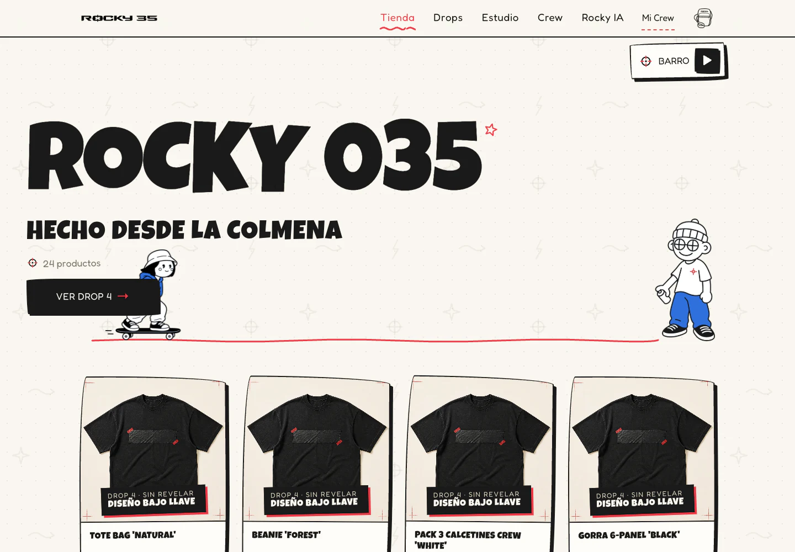
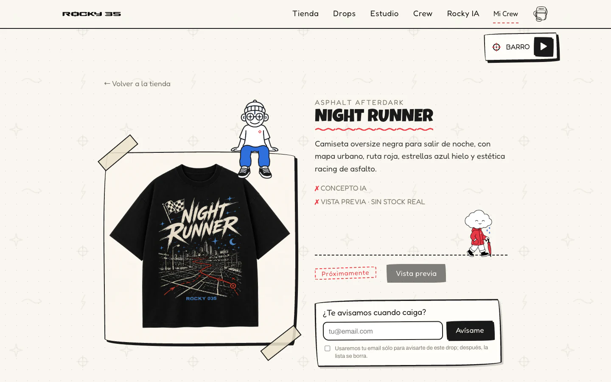
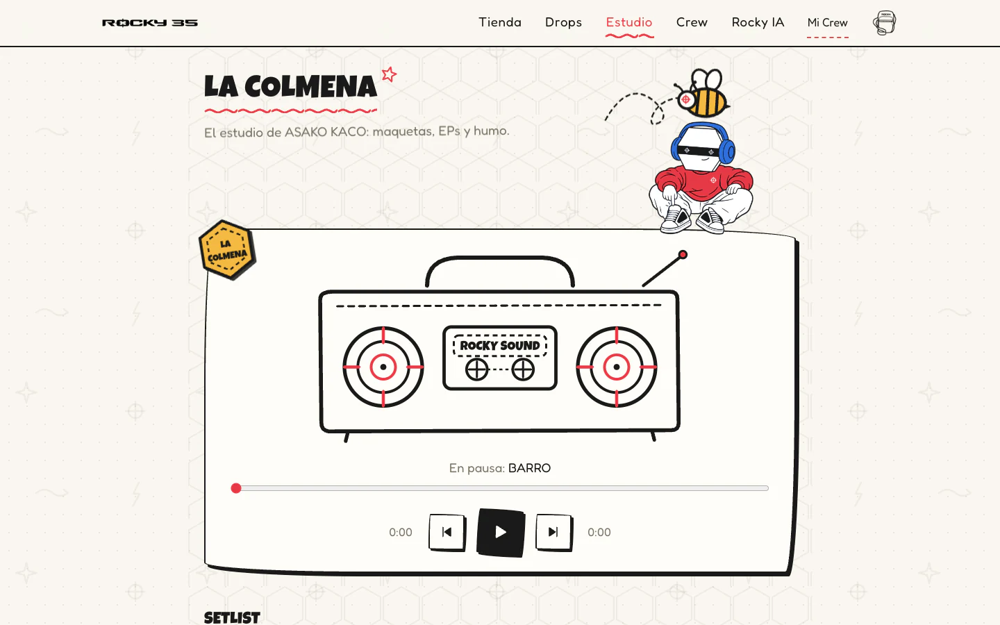
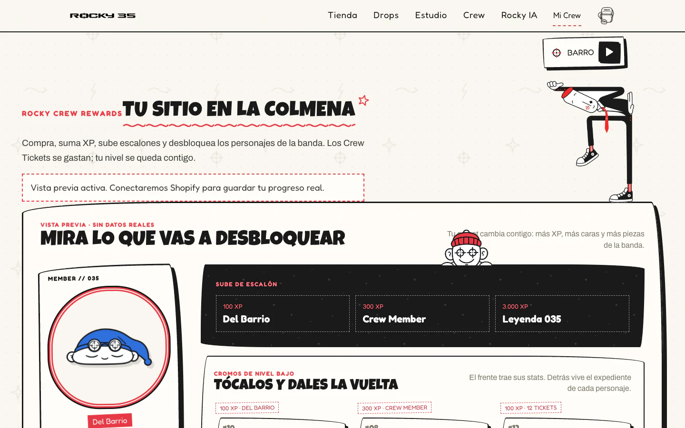
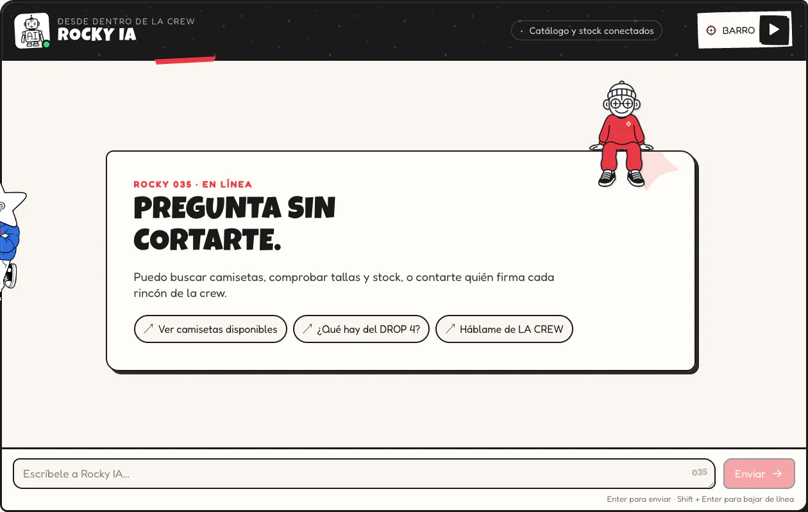

# ROCKY 035

Storefront full-stack para una marca de streetwear que mezcla tienda, música, personajes y comunidad en una experiencia con identidad propia. El frontend está construido con React y Vite; un BFF Express mantiene Shopify, las sesiones y Rocky IA fuera del navegador.

<p align="center">
  <a href="https://rocky035.com/"><strong>Ver la web</strong></a>
  ·
  <a href="https://www.instagram.com/rocky035/"><strong>Instagram</strong></a>
</p>

<p align="center">
  
</p>

## El proyecto

- **Storefront responsive:** catálogo, variantes, stock, carrito y checkout preparados para Shopify, con un modo demo completo para desarrollo.
- **Rocky IA:** asistente conectado al catálogo que puede orientar sobre productos, tallas y disponibilidad sin exponer secretos en el cliente.
- **La Colmena:** reproductor musical, setlist y una mesa de beats de 16 pasos que se ejecuta en el navegador.
- **Crew Rewards:** perfiles con XP, niveles, Crew Tickets, avatares y cromos coleccionables.
- **Backend seguro:** sesiones cifradas, OAuth con PKCE, webhooks verificados e idempotencia para las operaciones sensibles.

## Capturas

<table>
  <tr>
    <td width="50%">
      
      <br />
      <strong>Producto y drops</strong><br />
      Fichas visuales, variantes, disponibilidad y avisos de próximos lanzamientos.
    </td>
    <td width="50%">
      
      <br />
      <strong>La Colmena</strong><br />
      Música, narrativa de marca y herramientas interactivas dentro de la misma experiencia.
    </td>
  </tr>
  <tr>
    <td width="50%">
      
      <br />
      <strong>Crew Rewards</strong><br />
      Un sistema de fidelidad con progresión, tickets, personajes y coleccionables.
    </td>
    <td width="50%">
      
      <br />
      <strong>Rocky IA</strong><br />
      Asistente de compra contextual con acceso controlado al catálogo y al stock.
    </td>
  </tr>
</table>

## Stack

`React 19` · `Vite 8` · `Express 4` · `Shopify APIs` · `OpenRouter` · `Vitest`

## Requisitos

- Node.js 24 (la versión esperada está en `.nvmrc`).
- npm y un entorno Unix/macOS o Linux para los comandos de ejemplo.
- Para el modo Shopify: una tienda `*.myshopify.com` y, según las funciones activadas, credenciales del Headless channel, Dev Dashboard y Customer Account API.

## Arranque local

```bash
cp .env.example .env
npm install
npm run dev
```

La web queda en `http://localhost:3000` y Express en `http://localhost:3001`. Vite reenvía `/api` al BFF durante desarrollo. Si Shopify no está configurado, la interfaz muestra expresamente “Modo demo”; permite probar la presentación y un carrito local, pero no reserva stock ni habilita el pago.

Para crear la clave que cifra sesiones, IDs completos de carrito, OAuth, tokens de cliente, idempotencia y deduplicación de webhooks:

```bash
node -e "console.log(require('node:crypto').randomBytes(32).toString('base64'))"
```

Copia el resultado a `APP_ENCRYPTION_KEY` en el gestor de secretos del entorno. No reutilices la clave entre desarrollo y producción y no la guardes en Git.

## Comandos

```bash
npm run dev             # Vite + Express con recarga
npm run test:run        # suite Vitest una vez
npm run build           # frontend de producción en dist/
npm run security:check  # secretos locales y bundle
npm run check           # pruebas + build + secret scan
npm start               # sirve API y dist/ con Express
```

Para un smoke de producción:

```bash
NODE_ENV=production PUBLIC_ORIGIN=https://tienda.example.com PORT=3001 npm start
```

En producción, `PUBLIC_ORIGIN` y todos los `API_ALLOWED_ORIGINS` deben usar HTTPS. El proxy inverso debe terminar TLS, conservar `Host` y establecer `TRUST_PROXY_HOPS` al número exacto de proxies confiables; no uses un valor abierto.

## Activación de Shopify

La configuración es progresiva y falla cerrada:

| Capacidad | Configuración mínima |
| --- | --- |
| Catálogo | `SHOPIFY_STORE_DOMAIN` |
| Carrito y checkout | dominio + `APP_ENCRYPTION_KEY` |
| Storefront privado | `SHOPIFY_STOREFRONT_ACCESS_TOKEN` + `SHOPIFY_STOREFRONT_TOKEN_TYPE=private` |
| Cuenta de cliente | dominio + clave + `SHOPIFY_CUSTOMER_ACCOUNT_CLIENT_ID` + `PUBLIC_ORIGIN` HTTPS |
| Admin API | dominio + `SHOPIFY_CLIENT_ID` + `SHOPIFY_CLIENT_SECRET` |
| Webhooks y puntos Crew | dominio + clave + `SHOPIFY_CLIENT_SECRET` + scope Admin `read_orders` |

Usa `SHOPIFY_API_VERSION=2026-07`. Para cantidades exactas, activa `SHOPIFY_EXPOSE_QUANTITY=true` y concede el permiso Storefront `unauthenticated_read_product_inventory`; si no, la web sigue usando `availableForSale`. Para una futura lectura Admin de stock, solicita únicamente `read_products`, `read_inventory` y, si se consultan ubicaciones, `read_locations`. No concedas permisos de escritura si el servicio solo va a leer.

Si el token Storefront es privado, el BFF lo envía con `Shopify-Storefront-Private-Token` y adjunta la IP del comprador validada. Si se configura deliberadamente un token público, cambia `SHOPIFY_STOREFRONT_TOKEN_TYPE=public`. Ninguno de los dos se compila dentro de React.

Registra estas URLs en Shopify usando el dominio HTTPS final:

- Callback Customer Account: `https://tu-dominio/api/shopify/account/callback`
- Webhook: `https://tu-dominio/api/shopify/webhooks`
- Post-logout/origen: el valor exacto de `PUBLIC_ORIGIN`

Suscribe el webhook `orders/paid` a la URL anterior y mantenlo en
`SHOPIFY_WEBHOOK_TOPICS`. El perfil Crew sólo acredita pedidos pagados en EUR
que tengan un Customer de Shopify asociado; los checkouts como invitado no se
pueden asignar a una cuenta. Shopify debe conceder `read_orders` a la aplicación
para crear y mantener esa suscripción.

`SHOPIFY_CHECKOUT_HOSTS` solo es necesario cuando el checkout usa dominios adicionales al `*.myshopify.com` canónico. Introduce hostnames separados por comas, sin esquema, ruta ni puerto.

## Perfil, niveles y Crew Tickets

La ruta `/mi-crew` usa la identidad de Customer Accounts y muestra el carnet,
el nivel, el progreso, la colección, el historial acreditado y la zona de
canje. El cliente nunca envía su saldo: el servidor lo obtiene del almacén
cifrado ligado al Customer GID de Shopify.

- Cada euro completo pagado da `1 XP` permanente.
- Cada euro completo pagado da `0,1 Crew Ticket` gastable.
- Los céntimos no se redondean hacia arriba: un pedido de `34,99 EUR` da
  `34 XP` y `3,4 tickets`.
- Los niveles son Recién Llegado (0), Del Barrio (100), Crew Member (300),
  Rocky Rider (750), OG de la Colmena (1500) y Leyenda 035 (3000).
- Gastar tickets no reduce XP ni nivel. Los tickets sólo canjean recompensas
  digitales del perfil; no pagan productos ni descuentos de Shopify.
- Los eventos repetidos de Shopify y los reintentos de canje son idempotentes.

Rocky IA recibe un resumen Crew creado por el servidor únicamente cuando la
sesión tiene una cuenta Shopify autenticada. Puede hablar del nivel, XP,
tickets, colección y avatar, pero el navegador no puede inyectar esos datos.

La primera versión no revierte XP ni tickets tras reembolsos parciales o
totales. Mantén las recompensas como digitales hasta añadir conciliación de
`refunds/create` u `orders/cancelled`, y revisa manualmente las incidencias de
devolución mientras tanto.

## Rocky IA: personalidad y coste cero

La personalidad de Rocky IA vive exclusivamente en el servidor, en `server/rocky-prompt.mjs`. El navegador envía sólo el mensaje nuevo; no puede introducir roles, historial, prompt, modelo ni parámetros del proveedor. El historial se limita a ocho mensajes y se conserva en la sesión del servidor.

`OPENROUTER_MODELS` falla cerrado: cada identificador debe terminar en `:free` o ser exactamente `openrouter/free`. Una entrada pagada, mixta o vacía impide arrancar la aplicación. Los fallbacks también pertenecen a esa lista cerrada y nunca se sustituye un error por un modelo de pago.

La aplicación solicita metadatos de uso a OpenRouter. Si `usage.cost` está presente y es superior a cero, el proceso activa un cortacircuitos y deja de realizar llamadas hasta reiniciarse. Algunas respuestas gratuitas pueden omitir ese campo; en ese caso se registra el evento y se acepta la respuesta porque todos los modelos salientes ya están limitados por construcción a [variantes gratuitas](https://openrouter.ai/docs/guides/routing/model-variants/free). Esta comprobación es una alarma posterior a la respuesta; la barrera preventiva es la allowlist gratuita en código y en la cuenta de OpenRouter.

Configuración recomendada de la clave de producción:

- clave dedicada exclusivamente a `rocky035.com`;
- sin BYOK, tarjeta ni recarga automática;
- allowlist limitada a los modelos `:free` configurados;
- límite de gasto cero si el panel lo admite, o el mínimo técnico disponible;
- sin permisos de administración y con rotación independiente de desarrollo.

El nivel gratuito tiene disponibilidad y cuota reducidas. Por defecto, la web permite cinco mensajes por IP cada diez minutos, cuatro generaciones simultáneas y 45 peticiones globales cada 24 horas. Cuando se agota el límite, devuelve `429` sin llamar al proveedor. El contador es local al proceso y se reinicia al desplegar o reiniciar; no coordina varias réplicas.

## Frontera de seguridad

El navegador solo recibe DTOs saneados y envía `variantId`, `lineId`, cantidad e identificador de operación. El ID Shopify completo del carrito —que incluye `?key=...`— permanece cifrado en el servidor. El checkout se obtiene de Shopify en el último momento y se acepta únicamente por HTTPS y contra la lista de hosts permitidos.

Las cuentas usan discovery HTTPS, Authorization Code + PKCE, `state` de un solo uso ligado a la cookie que inició el login, `nonce`, verificación criptográfica del ID token, rotación de sesión y tokens cifrados con retención limitada. Los webhooks se verifican sobre el cuerpo crudo mediante HMAC constante, tienda/topic/versión exactos y deduplicación persistente.

Rocky IA exige un `Origin` exacto permitido, acepta únicamente `{ "message": string }`, mantiene los roles conversacionales en el servidor y bloquea intentos evidentes de revelar o cambiar sus instrucciones sin consumir una petición del proveedor.

Consulta [SECURITY.md](./SECURITY.md) para los controles de despliegue, rotación y limitaciones conocidas. La arquitectura detallada y la evidencia por tarea están en [docs/superpowers/plans/2026-08-07--shopify-security-readiness](./docs/superpowers/plans/2026-08-07--shopify-security-readiness/README.md).

## Almacenamiento y escalado

El estado se guarda como un único sobre AES-256-GCM con escrituras atómicas y permisos restrictivos. Está diseñado para una sola instancia Node con disco persistente. Antes de escalar horizontalmente o desplegar sobre disco efímero, migra las interfaces de sesión/idempotencia/webhooks a una base compartida con transacciones; no compartas el fichero entre procesos.

## Verificación antes de publicar

```bash
npm ci
npm run check
npm audit --audit-level=moderate
npm audit --omit=dev --audit-level=moderate
```

La CI repite estos controles en cada push y pull request. Las pruebas locales usan respuestas Shopify simuladas; antes de abrir ventas debes completar el E2E con una development store, callback HTTPS, variante real, carrito, checkout, login/logout y webhook firmado.
